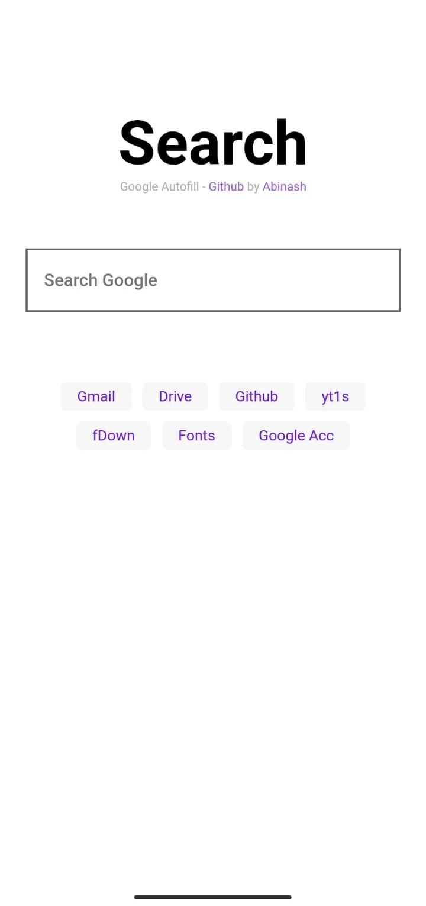
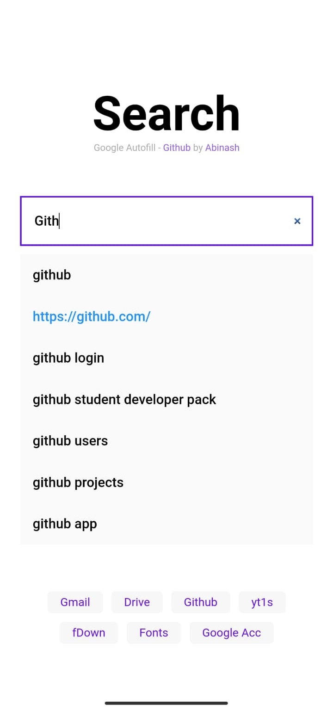

# Browser Homepage 🏡 & Search 🔎 Suggestions


# Hello, 👋

## Set this link as your browser's homepage
```
https://codeAbinash.github.io/homepage-browser/index.html
```

## Check yourself : [Open Page](https://codeabinash.github.io/homepage-browser/) 
## Lightweight ⚡ and Very Fast ⚡

## Sample Images


## Autofill by Google
